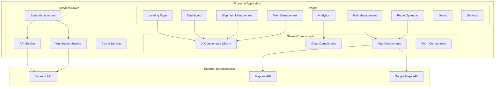

# Design Document

## Overview

The IntelliChain frontend is designed as a modern React + TypeScript single-page application that provides a comprehensive interface for logistics management. The system integrates with the existing backend API to deliver real-time fleet management, route optimization, and analytics capabilities. The architecture emphasizes component reusability, responsive design, and seamless API integration while maintaining high performance and accessibility standards.

## Architecture

### High-Level Architecture



### Technology Stack

**Core Framework:**
- React 18 with TypeScript for type safety and modern React features
- Vite for fast development and optimized builds
- React Router for client-side routing

**UI Framework:**
- Tailwind CSS for utility-first styling
- shadcn/ui component library for consistent, accessible components
- lucide-react for consistent iconography
- Framer Motion for smooth animations

**Data Visualization:**
- recharts for interactive charts and analytics
- Mapbox GL JS for interactive maps
- Google Maps JavaScript API as fallback

**State Management:**
- React Query (TanStack Query) for server state management
- Zustand for client-side state management
- React Hook Form for form state management

**Development Tools:**
- ESLint and Prettier for code quality
- Jest and React Testing Library for testing
- Storybook for component development

## Components and Interfaces

### 1. Global Layout System

#### Layout.tsx
```typescript
interface LayoutProps {
  children: React.ReactNode;
  showSidebar?: boolean;
  sidebarCollapsed?: boolean;
}

interface SidebarItem {
  id: string;
  label: string;
  icon: React.ComponentType;
  href: string;
  badge?: string | number;
  children?: SidebarItem[];
}

const sidebarItems: SidebarItem[] = [
  { id: 'dashboard', label: 'Dashboard', icon: LayoutDashboard, href: '/dashboard' },
  { id: 'shipments', label: 'Shipments', icon: Package, href: '/shipments' },
  { id: 'fleet', label: 'Fleet', icon: Truck, href: '/fleet' },
  { id: 'hubs', label: 'Hubs', icon: MapPin, href: '/hubs' },
  { id: 'routes', label: 'Route Optimizer', icon: Route, href: '/routes' },
  { id: 'analytics', label: 'Analytics', icon: BarChart3, href: '/analytics' },
  { id: 'demo', label: 'Demo', icon: Play, href: '/demo' },
  { id: 'settings', label: 'Settings', icon: Settings, href: '/settings' }
];
```

#### Topbar.tsx
```typescript
interface TopbarProps {
  onToggleSidebar: () => void;
  user?: User;
}

interface User {
  name: string;
  email: string;
  avatar?: string;
  role: 'admin' | 'manager' | 'operator';
}
```

### 2. Landing Page Components

#### HeroSection.tsx
```typescript
interface HeroSectionProps {
  title: string;
  subtitle: string;
  ctaText: string;
  ctaHref: string;
  backgroundImage?: string;
}

// Implementation includes:
// - Full-width background with gradient overlay
// - Animated text reveal
// - Purple gradient CTA button with hover effects
// - Responsive typography scaling
```

#### FeatureCard.tsx
```typescript
interface FeatureCardProps {
  icon: React.ComponentType<{ className?: string }>;
  title: string;
  description: string;
  delay?: number; // For staggered animations
}

// Features grid layout:
// - 4 cards in desktop, 2 in tablet, 1 in mobile
// - Hover effects with lift and shadow
// - Icon animation on hover
```

#### StatsCounter.tsx
```typescript
interface StatsCounterProps {
  label: string;
  value: number;
  suffix?: string;
  prefix?: string;
  duration?: number; // Animation duration
  format?: 'number' | 'percentage' | 'currency';
}

// Implementation includes:
// - Intersection Observer for trigger
// - Smooth counting animation
// - Number formatting utilities
```

### 3. Dashboard Components

#### DashboardCard.tsx
```typescript
interface DashboardCardProps {
  title: string;
  value: string | number;
  icon?: React.ComponentType<{ className?: string }>;
  trend?: {
    value: number;
    direction: 'up' | 'down';
    period: string;
  };
  link?: {
    text: string;
    href: string;
  };
  loading?: boolean;
  error?: string;
}

// Card variants:
// - Active Shipments: Blue header, count display
// - Fleet Status: Green/red status indicators
// - Hub Capacity: Pie chart integration
```

#### QuickActions.tsx
```typescript
interface QuickAction {
  id: string;
  label: string;
  icon: React.ComponentType;
  onClick: () => void;
  disabled?: boolean;
  loading?: boolean;
}

interface QuickActionsProps {
  actions: QuickAction[];
}
```

### 4. Shipment Management Components

#### ShipmentForm.tsx
```typescript
interface ShipmentFormData {
  pickupAddress: string;
  deliveryAddress: string;
  loadType: string;
  weight: number;
  deadline: Date;
  priority: 'low' | 'medium' | 'high' | 'urgent';
  specialInstructions?: string;
}

interface ShipmentFormProps {
  onSubmit: (data: ShipmentFormData) => Promise<void>;
  initialData?: Partial<ShipmentFormData>;
  loading?: boolean;
}

// Form features:
// - Google Places autocomplete for addresses
// - Real-time validation with error display
// - Loading states with spinner in submit button
// - Optimistic updates
```

#### ShipmentTable.tsx
```typescript
interface Shipment {
  id: string;
  msme: {
    name: string;
    id: string;
  };
  status: 'pending' | 'assigned' | 'in_transit' | 'delivered' | 'cancelled';
  eta: Date;
  pickupAddress: string;
  deliveryAddress: string;
  weight: number;
  priority: 'low' | 'medium' | 'high' | 'urgent';
}

interface ShipmentTableProps {
  shipments: Shipment[];
  onTrack: (shipmentId: string) => void;
  onEdit?: (shipmentId: string) => void;
  onCancel?: (shipmentId: string) => void;
  loading?: boolean;
  pagination?: PaginationProps;
}

// Table features:
// - Sortable columns
// - Status badges with color coding
// - Action dropdown menus
// - Mobile-responsive card layout
```

### 5. Fleet Management Components

#### FleetTable.tsx
```typescript
interface Vehicle {
  id: string;
  type: 'truck' | 'tempo' | 'van' | 'three-wheeler' | 'electric';
  status: 'available' | 'busy' | 'maintenance' | 'offline';
  fuelLevel: number; // Percentage
  driver: {
    name: string;
    id: string;
    phone?: string;
  };
  location: {
    lat: number;
    lng: number;
    address?: string;
  };
  capacity: {
    weight: number;
    volume: number;
  };
}

interface FleetTableProps {
  vehicles: Vehicle[];
  onAssign: (vehicleId: string) => void;
  onTrack: (vehicleId: string) => void;
  onMaintenance: (vehicleId: string) => void;
  loading?: boolean;
}
```

#### AssignVehicleModal.tsx
```typescript
interface AssignVehicleModalProps {
  vehicleId: string;
  vehicle: Vehicle;
  availableShipments: Shipment[];
  isOpen: boolean;
  onClose: () => void;
  onConfirm: (shipmentId: string) => Promise<void>;
}

// Modal features:
// - Shipment filtering and search
// - Compatibility checking
// - Confirmation with loading state
```

### 6. Hub Management Components

#### HubMap.tsx
```typescript
interface Hub {
  id: string;
  name: string;
  location: {
    lat: number;
    lng: number;
    address: string;
  };
  capacity: {
    total: number;
    used: number;
    available: number;
  };
  bufferVehicles: Vehicle[];
  operatingHours: {
    open: string;
    close: string;
  };
  status: 'operational' | 'maintenance' | 'closed';
}

interface HubMapProps {
  hubs: Hub[];
  selectedHub?: string;
  onSelectHub: (hubId: string) => void;
  onReassignShipment?: (hubId: string, shipmentId: string) => void;
}

// Map features:
// - Custom hub markers with status colors
// - Clustering for nearby hubs
// - Real-time capacity updates
// - Interactive hub selection
```

#### HubSidebar.tsx
```typescript
interface HubSidebarProps {
  hubs: Hub[];
  selectedHub?: string;
  onSelectHub: (hubId: string) => void;
  loading?: boolean;
}

// Sidebar features:
// - Capacity progress bars
// - Status indicators
// - Search and filtering
// - Real-time updates
```

#### HubDetailModal.tsx
```typescript
interface HubDetailModalProps {
  hub: Hub;
  isOpen: boolean;
  onClose: () => void;
  onReassign: (shipmentId: string) => void;
  availableShipments?: Shipment[];
}
```

### 7. Route Optimizer Components

#### RouteMap.tsx
```typescript
interface Waypoint {
  id: string;
  location: {
    lat: number;
    lng: number;
    address?: string;
  };
  type: 'pickup' | 'delivery' | 'hub';
  shipmentId?: string;
  timeWindow?: {
    start: Date;
    end: Date;
  };
}

interface Route {
  id: string;
  vehicleId: string;
  waypoints: Waypoint[];
  estimatedDuration: number;
  estimatedDistance: number;
  estimatedCost: number;
  constraints: RouteConstraint[];
}

interface RouteMapProps {
  waypoints: Waypoint[];
  routes: Route[];
  onAddWaypoint: (location: { lat: number; lng: number }) => void;
  onMoveWaypoint: (waypointId: string, location: { lat: number; lng: number }) => void;
  onRemoveWaypoint: (waypointId: string) => void;
  onOptimize: () => void;
  optimizing?: boolean;
}

// Map features:
// - Draggable waypoint markers
// - Route visualization with different colors
// - Constraint violation overlays
// - Real-time optimization preview
```

#### OptimizationPanel.tsx
```typescript
interface VehicleAssignment {
  vehicleId: string;
  vehicle: Vehicle;
  assignedWaypoints: Waypoint[];
  estimatedDuration: number;
  estimatedCost: number;
  constraints: RouteConstraint[];
  violations: ConstraintViolation[];
}

interface OptimizationPanelProps {
  assignments: VehicleAssignment[];
  onOptimize: () => void;
  onAssignVehicle: (waypointId: string, vehicleId: string) => void;
  optimizing?: boolean;
  canOptimize: boolean;
}
```

### 8. Analytics Components

#### ChartCard.tsx
```typescript
interface ChartCardProps {
  title: string;
  description?: string;
  chart: React.ReactNode;
  loading?: boolean;
  error?: string;
  actions?: React.ReactNode;
}
```

#### FuelEfficiencyChart.tsx
```typescript
interface FuelEfficiencyData {
  date: string;
  efficiency: number;
  target: number;
  savings: number;
}

interface FuelEfficiencyChartProps {
  data: FuelEfficiencyData[];
  timeRange: 'week' | 'month' | 'quarter' | 'year';
  onTimeRangeChange: (range: string) => void;
}
```

#### DeliveryTimesChart.tsx
```typescript
interface DeliveryTimeData {
  period: string;
  averageTime: number;
  target: number;
  onTimePercentage: number;
}

interface DeliveryTimesChartProps {
  data: DeliveryTimeData[];
  groupBy: 'day' | 'week' | 'month';
  onGroupByChange: (groupBy: string) => void;
}
```

#### CostSavingsChart.tsx
```typescript
interface CostSavingsData {
  date: string;
  savings: number;
  cumulativeSavings: number;
  category: 'fuel' | 'time' | 'maintenance' | 'other';
}

interface CostSavingsChartProps {
  data: CostSavingsData[];
  showCumulative?: boolean;
  onToggleCumulative: (show: boolean) => void;
}
```

### 9. Demo Components

#### DemoControlPanel.tsx
```typescript
interface DemoScenario {
  id: string;
  name: string;
  description: string;
  duration: number;
  vehicles: Vehicle[];
  shipments: Shipment[];
  events: DemoEvent[];
}

interface DemoEvent {
  id: string;
  type: 'breakdown' | 'delay' | 'traffic' | 'weather';
  timestamp: number;
  vehicleId?: string;
  hubId?: string;
  description: string;
}

interface DemoControlPanelProps {
  scenarios: DemoScenario[];
  currentScenario?: DemoScenario;
  onLoadScenario: (scenarioId: string) => void;
  onTriggerEvent: (event: DemoEvent) => void;
  onReset: () => void;
  isRunning: boolean;
}
```

### 10. Settings Components

#### ProfileForm.tsx
```typescript
interface UserProfile {
  name: string;
  email: string;
  phone?: string;
  company: string;
  logo?: File | string;
  notifications: {
    email: boolean;
    sms: boolean;
    push: boolean;
  };
}

interface ProfileFormProps {
  profile: UserProfile;
  onSave: (profile: UserProfile) => Promise<void>;
  loading?: boolean;
}
```

#### SubscriptionToggle.tsx
```typescript
interface SubscriptionPlan {
  id: string;
  name: 'Basic' | 'Premium' | 'Enterprise';
  price: number;
  features: string[];
  limits: {
    vehicles: number;
    shipments: number;
    apiCalls: number;
  };
}

interface SubscriptionToggleProps {
  currentPlan: SubscriptionPlan;
  availablePlans: SubscriptionPlan[];
  onChangePlan: (planId: string) => Promise<void>;
}
```

#### ApiKeyManager.tsx
```typescript
interface ApiKey {
  id: string;
  name: string;
  key: string;
  permissions: string[];
  createdAt: Date;
  lastUsed?: Date;
  expiresAt?: Date;
}

interface ApiKeyManagerProps {
  apiKeys: ApiKey[];
  onGenerate: (name: string, permissions: string[]) => Promise<void>;
  onRevoke: (keyId: string) => Promise<void>;
  onRegenerate: (keyId: string) => Promise<void>;
}
```

## Data Models and API Integration

### Core Data Models

```typescript
// Vehicle Model
interface Vehicle {
  id: string;
  type: 'truck' | 'tempo' | 'van' | 'three-wheeler' | 'electric';
  subType: string;
  capacity: {
    weight: number;
    volume: number;
    maxDimensions: {
      length: number;
      width: number;
      height: number;
    };
  };
  location: {
    latitude: number;
    longitude: number;
    timestamp: Date;
    address?: string;
  };
  status: 'available' | 'in-transit' | 'loading' | 'maintenance' | 'breakdown';
  compliance: {
    pollutionCertificate: boolean;
    pollutionLevel: 'BS6' | 'BS4' | 'BS3' | 'electric';
    permitValid: boolean;
    oddEvenCompliant: boolean;
    zoneRestrictions: string[];
  };
  driver: {
    id: string;
    name: string;
    phone: string;
    workingHours: number;
    maxWorkingHours: number;
  };
  fuelLevel: number;
  lastMaintenance: Date;
  nextMaintenance: Date;
}

// Delivery Model
interface Delivery {
  id: string;
  msme: {
    id: string;
    name: string;
    contact: string;
  };
  pickupLocation: {
    latitude: number;
    longitude: number;
    address: string;
    contactPerson: string;
    phone: string;
  };
  deliveryLocation: {
    latitude: number;
    longitude: number;
    address: string;
    contactPerson: string;
    phone: string;
  };
  timeWindow: {
    earliest: Date;
    latest: Date;
  };
  shipment: {
    weight: number;
    volume: number;
    fragile: boolean;
    specialHandling: string[];
    description: string;
  };
  priority: 'low' | 'medium' | 'high' | 'urgent';
  status: 'pending' | 'assigned' | 'picked_up' | 'in_transit' | 'delivered' | 'cancelled';
  assignedVehicle?: string;
  estimatedCost: number;
  actualCost?: number;
  createdAt: Date;
  updatedAt: Date;
}

// Hub Model
interface Hub {
  id: string;
  name: string;
  location: {
    latitude: number;
    longitude: number;
    address: string;
  };
  capacity: {
    vehicles: number;
    storage: number;
    currentVehicles: number;
    currentStorage: number;
  };
  bufferVehicles: Vehicle[];
  operatingHours: {
    open: string;
    close: string;
    timezone: string;
  };
  facilities: string[];
  status: 'operational' | 'maintenance' | 'closed';
  manager: {
    name: string;
    phone: string;
    email: string;
  };
}

// Route Model
interface Route {
  id: string;
  vehicleId: string;
  stops: RouteStop[];
  estimatedDuration: number;
  estimatedDistance: number;
  estimatedFuelConsumption: number;
  estimatedCost: number;
  actualDuration?: number;
  actualDistance?: number;
  actualFuelConsumption?: number;
  actualCost?: number;
  status: 'planned' | 'active' | 'completed' | 'cancelled';
  trafficFactors: TrafficFactor[];
  constraints: RouteConstraint[];
  optimizationScore: number;
  createdAt: Date;
  startedAt?: Date;
  completedAt?: Date;
}

interface RouteStop {
  id: string;
  deliveryId: string;
  sequence: number;
  location: {
    latitude: number;
    longitude: number;
    address: string;
  };
  type: 'pickup' | 'delivery' | 'hub';
  estimatedArrival: Date;
  actualArrival?: Date;
  estimatedDeparture: Date;
  actualDeparture?: Date;
  status: 'pending' | 'arrived' | 'completed' | 'skipped';
}
```

### API Service Layer

```typescript
// API Client Configuration
interface ApiConfig {
  baseURL: string;
  timeout: number;
  retryAttempts: number;
  retryDelay: number;
}

// API Service Interface
interface ApiService {
  // Vehicle endpoints
  getVehicles(filters?: VehicleFilters): Promise<Vehicle[]>;
  getVehicle(id: string): Promise<Vehicle>;
  updateVehicleStatus(id: string, status: VehicleStatus): Promise<void>;
  assignVehicle(vehicleId: string, shipmentId: string): Promise<void>;
  
  // Shipment endpoints
  createShipment(shipment: CreateShipmentRequest): Promise<Delivery>;
  getShipments(filters?: ShipmentFilters): Promise<Delivery[]>;
  getShipment(id: string): Promise<Delivery>;
  updateShipment(id: string, updates: Partial<Delivery>): Promise<Delivery>;
  cancelShipment(id: string): Promise<void>;
  
  // Hub endpoints
  getHubs(): Promise<Hub[]>;
  getHub(id: string): Promise<Hub>;
  updateHubCapacity(id: string, capacity: number): Promise<void>;
  reassignShipment(hubId: string, shipmentId: string): Promise<void>;
  
  // Route optimization endpoints
  optimizeRoute(request: RouteOptimizationRequest): Promise<Route[]>;
  getRoute(id: string): Promise<Route>;
  updateRoute(id: string, updates: Partial<Route>): Promise<Route>;
  
  // Analytics endpoints
  getFuelEfficiencyData(timeRange: TimeRange): Promise<FuelEfficiencyData[]>;
  getDeliveryTimeData(timeRange: TimeRange): Promise<DeliveryTimeData[]>;
  getCostSavingsData(timeRange: TimeRange): Promise<CostSavingsData[]>;
  
  // User management endpoints
  getUserProfile(): Promise<UserProfile>;
  updateUserProfile(profile: Partial<UserProfile>): Promise<UserProfile>;
  getApiKeys(): Promise<ApiKey[]>;
  generateApiKey(name: string, permissions: string[]): Promise<ApiKey>;
  revokeApiKey(keyId: string): Promise<void>;
}

// Error Handling
interface ApiError {
  code: string;
  message: string;
  details?: any;
  timestamp: Date;
}

class ApiErrorHandler {
  static handle(error: ApiError): void {
    // Log error
    console.error('API Error:', error);
    
    // Show user-friendly message
    switch (error.code) {
      case 'NETWORK_ERROR':
        toast.error('Network connection failed. Please check your internet connection.');
        break;
      case 'UNAUTHORIZED':
        toast.error('Session expired. Please log in again.');
        // Redirect to login
        break;
      case 'VALIDATION_ERROR':
        toast.error('Please check your input and try again.');
        break;
      default:
        toast.error('An unexpected error occurred. Please try again.');
    }
  }
}
```

### State Management

```typescript
// Global State Store (Zustand)
interface AppState {
  // User state
  user: User | null;
  isAuthenticated: boolean;
  
  // UI state
  sidebarCollapsed: boolean;
  theme: 'light' | 'dark';
  
  // Real-time data
  vehicles: Vehicle[];
  shipments: Delivery[];
  hubs: Hub[];
  routes: Route[];
  
  // Loading states
  loading: {
    vehicles: boolean;
    shipments: boolean;
    hubs: boolean;
    routes: boolean;
  };
  
  // Actions
  setUser: (user: User | null) => void;
  toggleSidebar: () => void;
  setTheme: (theme: 'light' | 'dark') => void;
  updateVehicles: (vehicles: Vehicle[]) => void;
  updateShipments: (shipments: Delivery[]) => void;
  updateHubs: (hubs: Hub[]) => void;
  updateRoutes: (routes: Route[]) => void;
  setLoading: (key: keyof AppState['loading'], loading: boolean) => void;
}

// React Query Configuration
const queryClient = new QueryClient({
  defaultOptions: {
    queries: {
      staleTime: 5 * 60 * 1000, // 5 minutes
      cacheTime: 10 * 60 * 1000, // 10 minutes
      retry: (failureCount, error) => {
        if (error.status === 404) return false;
        return failureCount < 3;
      },
    },
  },
});

// Custom Hooks for Data Fetching
function useVehicles(filters?: VehicleFilters) {
  return useQuery({
    queryKey: ['vehicles', filters],
    queryFn: () => apiService.getVehicles(filters),
    refetchInterval: 30000, // Refetch every 30 seconds
  });
}

function useShipments(filters?: ShipmentFilters) {
  return useQuery({
    queryKey: ['shipments', filters],
    queryFn: () => apiService.getShipments(filters),
    refetchInterval: 60000, // Refetch every minute
  });
}

function useOptimizeRoute() {
  const queryClient = useQueryClient();
  
  return useMutation({
    mutationFn: (request: RouteOptimizationRequest) => 
      apiService.optimizeRoute(request),
    onSuccess: () => {
      // Invalidate and refetch routes
      queryClient.invalidateQueries(['routes']);
      toast.success('Route optimized successfully!');
    },
    onError: (error: ApiError) => {
      ApiErrorHandler.handle(error);
    },
  });
}
```

### WebSocket Integration

```typescript
// WebSocket Service for Real-time Updates
class WebSocketService {
  private ws: WebSocket | null = null;
  private reconnectAttempts = 0;
  private maxReconnectAttempts = 5;
  private reconnectDelay = 1000;
  
  connect(url: string, token: string): void {
    this.ws = new WebSocket(`${url}?token=${token}`);
    
    this.ws.onopen = () => {
      console.log('WebSocket connected');
      this.reconnectAttempts = 0;
    };
    
    this.ws.onmessage = (event) => {
      const data = JSON.parse(event.data);
      this.handleMessage(data);
    };
    
    this.ws.onclose = () => {
      console.log('WebSocket disconnected');
      this.reconnect();
    };
    
    this.ws.onerror = (error) => {
      console.error('WebSocket error:', error);
    };
  }
  
  private handleMessage(data: any): void {
    switch (data.type) {
      case 'vehicle_update':
        // Update vehicle in store
        useAppStore.getState().updateVehicles([data.vehicle]);
        break;
      case 'shipment_update':
        // Update shipment in store
        useAppStore.getState().updateShipments([data.shipment]);
        break;
      case 'route_update':
        // Update route in store
        useAppStore.getState().updateRoutes([data.route]);
        break;
      case 'notification':
        // Show notification
        toast.info(data.message);
        break;
    }
  }
  
  private reconnect(): void {
    if (this.reconnectAttempts < this.maxReconnectAttempts) {
      setTimeout(() => {
        this.reconnectAttempts++;
        this.connect(/* url, token */);
      }, this.reconnectDelay * Math.pow(2, this.reconnectAttempts));
    }
  }
  
  disconnect(): void {
    if (this.ws) {
      this.ws.close();
      this.ws = null;
    }
  }
}
```

## Styling and Design System

### Tailwind Configuration

```typescript
// tailwind.config.js
module.exports = {
  content: ['./src/**/*.{js,ts,jsx,tsx}'],
  theme: {
    extend: {
      colors: {
        primary: {
          50: '#f0f9ff',
          500: '#7f3dff',
          600: '#6d28d9',
          700: '#5b21b6',
        },
        success: {
          50: '#f0fdf4',
          500: '#22c55e',
          600: '#16a34a',
        },
        warning: {
          50: '#fffbeb',
          500: '#f59e0b',
          600: '#d97706',
        },
        error: {
          50: '#fef2f2',
          500: '#ef4444',
          600: '#dc2626',
        },
      },
      fontFamily: {
        sans: ['Inter', 'system-ui', 'sans-serif'],
      },
      animation: {
        'fade-in': 'fadeIn 0.5s ease-in-out',
        'slide-up': 'slideUp 0.3s ease-out',
        'pulse-slow': 'pulse 3s infinite',
      },
    },
  },
  plugins: [
    require('@tailwindcss/forms'),
    require('@tailwindcss/typography'),
  ],
};
```

### Component Styling Patterns

```typescript
// Button Component with Variants
interface ButtonProps {
  variant: 'primary' | 'secondary' | 'outline' | 'ghost' | 'danger';
  size: 'sm' | 'md' | 'lg';
  loading?: boolean;
  disabled?: boolean;
  children: React.ReactNode;
  onClick?: () => void;
}

const buttonVariants = {
  primary: 'bg-primary-500 hover:bg-primary-600 text-white',
  secondary: 'bg-gray-500 hover:bg-gray-600 text-white',
  outline: 'border border-primary-500 text-primary-500 hover:bg-primary-50',
  ghost: 'text-primary-500 hover:bg-primary-50',
  danger: 'bg-error-500 hover:bg-error-600 text-white',
};

const buttonSizes = {
  sm: 'px-3 py-1.5 text-sm',
  md: 'px-4 py-2 text-base',
  lg: 'px-6 py-3 text-lg',
};

// Status Badge Component
interface StatusBadgeProps {
  status: 'available' | 'busy' | 'offline' | 'maintenance';
  size?: 'sm' | 'md';
}

const statusColors = {
  available: 'bg-success-100 text-success-800',
  busy: 'bg-warning-100 text-warning-800',
  offline: 'bg-gray-100 text-gray-800',
  maintenance: 'bg-error-100 text-error-800',
};
```

## Performance Optimization

### Code Splitting and Lazy Loading

```typescript
// Route-based code splitting
const Dashboard = lazy(() => import('./pages/Dashboard'));
const ShipmentManagement = lazy(() => import('./pages/ShipmentManagement'));
const FleetManagement = lazy(() => import('./pages/FleetManagement'));
const HubManagement = lazy(() => import('./pages/HubManagement'));
const RouteOptimizer = lazy(() => import('./pages/RouteOptimizer'));
const Analytics = lazy(() => import('./pages/Analytics'));
const Demo = lazy(() => import('./pages/Demo'));
const Settings = lazy(() => import('./pages/Settings'));

// Component-based lazy loading for heavy components
const MapComponent = lazy(() => import('./components/MapComponent'));
const ChartComponent = lazy(() => import('./components/ChartComponent'));
```

### Memoization and Optimization

```typescript
// Memoized components for expensive renders
const VehicleTable = memo(({ vehicles, onAssign }: VehicleTableProps) => {
  const sortedVehicles = useMemo(() => 
    vehicles.sort((a, b) => a.status.localeCompare(b.status)),
    [vehicles]
  );
  
  const handleAssign = useCallback((vehicleId: string) => {
    onAssign(vehicleId);
  }, [onAssign]);
  
  return (
    // Table implementation
  );
});

// Virtual scrolling for large datasets
const VirtualizedTable = ({ items, renderItem }: VirtualizedTableProps) => {
  return (
    <FixedSizeList
      height={600}
      itemCount={items.length}
      itemSize={60}
      itemData={items}
    >
      {renderItem}
    </FixedSizeList>
  );
};
```

### Caching Strategies

```typescript
// Service Worker for API caching
const cacheConfig = {
  // Cache static assets for 1 year
  staticAssets: {
    pattern: /\.(js|css|png|jpg|jpeg|svg|woff2?)$/,
    strategy: 'CacheFirst',
    cacheName: 'static-assets',
    expiration: {
      maxAgeSeconds: 365 * 24 * 60 * 60,
    },
  },
  
  // Cache API responses for 5 minutes
  apiResponses: {
    pattern: /\/api\//,
    strategy: 'StaleWhileRevalidate',
    cacheName: 'api-cache',
    expiration: {
      maxAgeSeconds: 5 * 60,
    },
  },
};

// Memory caching for computed values
const useComputedMetrics = (data: AnalyticsData[]) => {
  return useMemo(() => {
    return {
      totalSavings: data.reduce((sum, item) => sum + item.savings, 0),
      averageEfficiency: data.reduce((sum, item) => sum + item.efficiency, 0) / data.length,
      trendDirection: calculateTrend(data),
    };
  }, [data]);
};
```

## Accessibility Implementation

### ARIA Labels and Semantic HTML

```typescript
// Accessible form components
const AccessibleInput = ({ label, error, ...props }: InputProps) => {
  const id = useId();
  const errorId = `${id}-error`;
  
  return (
    <div className="space-y-1">
      <label htmlFor={id} className="block text-sm font-medium">
        {label}
      </label>
      <input
        id={id}
        aria-describedby={error ? errorId : undefined}
        aria-invalid={!!error}
        className={cn(
          'block w-full rounded-md border-gray-300',
          error && 'border-error-500 focus:border-error-500'
        )}
        {...props}
      />
      {error && (
        <p id={errorId} className="text-sm text-error-600" role="alert">
          {error}
        </p>
      )}
    </div>
  );
};

// Accessible table with proper headers
const AccessibleTable = ({ data, columns }: TableProps) => {
  return (
    <table role="table" aria-label="Fleet management data">
      <thead>
        <tr>
          {columns.map((column) => (
            <th
              key={column.key}
              scope="col"
              className="px-6 py-3 text-left text-xs font-medium uppercase tracking-wider"
            >
              {column.label}
            </th>
          ))}
        </tr>
      </thead>
      <tbody>
        {data.map((row, index) => (
          <tr key={row.id} className={index % 2 === 0 ? 'bg-white' : 'bg-gray-50'}>
            {columns.map((column) => (
              <td key={column.key} className="px-6 py-4 whitespace-nowrap">
                {row[column.key]}
              </td>
            ))}
          </tr>
        ))}
      </tbody>
    </table>
  );
};
```

### Keyboard Navigation

```typescript
// Keyboard navigation for interactive elements
const useKeyboardNavigation = (items: any[], onSelect: (item: any) => void) => {
  const [focusedIndex, setFocusedIndex] = useState(0);
  
  const handleKeyDown = useCallback((event: KeyboardEvent) => {
    switch (event.key) {
      case 'ArrowDown':
        event.preventDefault();
        setFocusedIndex((prev) => Math.min(prev + 1, items.length - 1));
        break;
      case 'ArrowUp':
        event.preventDefault();
        setFocusedIndex((prev) => Math.max(prev - 1, 0));
        break;
      case 'Enter':
      case ' ':
        event.preventDefault();
        onSelect(items[focusedIndex]);
        break;
      case 'Escape':
        setFocusedIndex(0);
        break;
    }
  }, [items, focusedIndex, onSelect]);
  
  useEffect(() => {
    document.addEventListener('keydown', handleKeyDown);
    return () => document.removeEventListener('keydown', handleKeyDown);
  }, [handleKeyDown]);
  
  return { focusedIndex, setFocusedIndex };
};
```

## Testing Strategy

### Unit Testing with Jest and React Testing Library

```typescript
// Component testing example
describe('ShipmentForm', () => {
  const mockOnSubmit = jest.fn();
  
  beforeEach(() => {
    mockOnSubmit.mockClear();
  });
  
  it('should render all form fields', () => {
    render(<ShipmentForm onSubmit={mockOnSubmit} />);
    
    expect(screen.getByLabelText(/pickup address/i)).toBeInTheDocument();
    expect(screen.getByLabelText(/delivery address/i)).toBeInTheDocument();
    expect(screen.getByLabelText(/load type/i)).toBeInTheDocument();
    expect(screen.getByLabelText(/weight/i)).toBeInTheDocument();
    expect(screen.getByLabelText(/deadline/i)).toBeInTheDocument();
  });
  
  it('should validate required fields', async () => {
    render(<ShipmentForm onSubmit={mockOnSubmit} />);
    
    const submitButton = screen.getByRole('button', { name: /create shipment/i });
    fireEvent.click(submitButton);
    
    await waitFor(() => {
      expect(screen.getByText(/pickup address is required/i)).toBeInTheDocument();
      expect(screen.getByText(/delivery address is required/i)).toBeInTheDocument();
    });
    
    expect(mockOnSubmit).not.toHaveBeenCalled();
  });
  
  it('should submit form with valid data', async () => {
    render(<ShipmentForm onSubmit={mockOnSubmit} />);
    
    fireEvent.change(screen.getByLabelText(/pickup address/i), {
      target: { value: '123 Main St, Delhi' }
    });
    fireEvent.change(screen.getByLabelText(/delivery address/i), {
      target: { value: '456 Oak Ave, Delhi' }
    });
    fireEvent.change(screen.getByLabelText(/weight/i), {
      target: { value: '100' }
    });
    
    const submitButton = screen.getByRole('button', { name: /create shipment/i });
    fireEvent.click(submitButton);
    
    await waitFor(() => {
      expect(mockOnSubmit).toHaveBeenCalledWith({
        pickupAddress: '123 Main St, Delhi',
        deliveryAddress: '456 Oak Ave, Delhi',
        weight: 100,
        // ... other form data
      });
    });
  });
});

// API service testing
describe('ApiService', () => {
  beforeEach(() => {
    fetchMock.resetMocks();
  });
  
  it('should fetch vehicles successfully', async () => {
    const mockVehicles = [
      { id: '1', type: 'truck', status: 'available' },
      { id: '2', type: 'van', status: 'busy' }
    ];
    
    fetchMock.mockResponseOnce(JSON.stringify(mockVehicles));
    
    const vehicles = await apiService.getVehicles();
    
    expect(vehicles).toEqual(mockVehicles);
    expect(fetchMock).toHaveBeenCalledWith('/api/vehicles');
  });
  
  it('should handle API errors gracefully', async () => {
    fetchMock.mockRejectOnce(new Error('Network error'));
    
    await expect(apiService.getVehicles()).rejects.toThrow('Network error');
  });
});
```

### Integration Testing

```typescript
// End-to-end workflow testing
describe('Shipment Creation Workflow', () => {
  it('should create and assign shipment successfully', async () => {
    // Mock API responses
    server.use(
      rest.post('/api/shipments/create', (req, res, ctx) => {
        return res(ctx.json({ id: '123', status: 'pending' }));
      }),
      rest.get('/api/vehicles', (req, res, ctx) => {
        return res(ctx.json([
          { id: 'v1', type: 'truck', status: 'available' }
        ]));
      }),
      rest.post('/api/fleet/assign', (req, res, ctx) => {
        return res(ctx.json({ success: true }));
      })
    );
    
    render(<App />);
    
    // Navigate to shipment creation
    fireEvent.click(screen.getByText(/create shipment/i));
    
    // Fill out form
    fireEvent.change(screen.getByLabelText(/pickup address/i), {
      target: { value: 'Connaught Place, Delhi' }
    });
    fireEvent.change(screen.getByLabelText(/delivery address/i), {
      target: { value: 'Karol Bagh, Delhi' }
    });
    
    // Submit form
    fireEvent.click(screen.getByRole('button', { name: /create shipment/i }));
    
    // Wait for success message
    await waitFor(() => {
      expect(screen.getByText(/shipment created successfully/i)).toBeInTheDocument();
    });
    
    // Navigate to fleet management
    fireEvent.click(screen.getByText(/fleet/i));
    
    // Assign vehicle
    fireEvent.click(screen.getByText(/assign vehicle/i));
    fireEvent.click(screen.getByText(/confirm assignment/i));
    
    // Verify assignment
    await waitFor(() => {
      expect(screen.getByText(/vehicle assigned successfully/i)).toBeInTheDocument();
    });
  });
});
```

## Security Considerations

### Authentication and Authorization

```typescript
// Auth context and hooks
interface AuthContextType {
  user: User | null;
  login: (credentials: LoginCredentials) => Promise<void>;
  logout: () => void;
  isAuthenticated: boolean;
  hasPermission: (permission: string) => boolean;
}

const AuthContext = createContext<AuthContextType | null>(null);

export const useAuth = () => {
  const context = useContext(AuthContext);
  if (!context) {
    throw new Error('useAuth must be used within AuthProvider');
  }
  return context;
};

// Protected route component
const ProtectedRoute = ({ 
  children, 
  requiredPermission 
}: ProtectedRouteProps) => {
  const { isAuthenticated, hasPermission } = useAuth();
  
  if (!isAuthenticated) {
    return <Navigate to="/login" replace />;
  }
  
  if (requiredPermission && !hasPermission(requiredPermission)) {
    return <Navigate to="/unauthorized" replace />;
  }
  
  return <>{children}</>;
};
```

### Input Validation and Sanitization

```typescript
// Form validation schemas
const shipmentFormSchema = z.object({
  pickupAddress: z.string().min(1, 'Pickup address is required'),
  deliveryAddress: z.string().min(1, 'Delivery address is required'),
  weight: z.number().min(0.1, 'Weight must be greater than 0'),
  loadType: z.string().min(1, 'Load type is required'),
  deadline: z.date().min(new Date(), 'Deadline must be in the future'),
});

// Input sanitization
const sanitizeInput = (input: string): string => {
  return DOMPurify.sanitize(input.trim());
};

// XSS protection for dynamic content
const SafeHTML = ({ content }: { content: string }) => {
  const sanitizedContent = DOMPurify.sanitize(content);
  return <div dangerouslySetInnerHTML={{ __html: sanitizedContent }} />;
};
```

## Deployment and Build Configuration

### Vite Configuration

```typescript
// vite.config.ts
export default defineConfig({
  plugins: [
    react(),
    // PWA plugin for offline support
    VitePWA({
      registerType: 'autoUpdate',
      workbox: {
        globPatterns: ['**/*.{js,css,html,ico,png,svg}'],
        runtimeCaching: [
          {
            urlPattern: /^https:\/\/api\./,
            handler: 'StaleWhileRevalidate',
            options: {
              cacheName: 'api-cache',
              expiration: {
                maxEntries: 100,
                maxAgeSeconds: 60 * 60 * 24, // 24 hours
              },
            },
          },
        ],
      },
    }),
  ],
  build: {
    rollupOptions: {
      output: {
        manualChunks: {
          vendor: ['react', 'react-dom'],
          ui: ['@radix-ui/react-dialog', '@radix-ui/react-dropdown-menu'],
          charts: ['recharts'],
          maps: ['mapbox-gl'],
        },
      },
    },
    sourcemap: true,
    minify: 'terser',
    terserOptions: {
      compress: {
        drop_console: true,
        drop_debugger: true,
      },
    },
  },
  server: {
    proxy: {
      '/api': {
        target: 'http://localhost:3001',
        changeOrigin: true,
      },
    },
  },
});
```

### Environment Configuration

```typescript
// Environment variables
interface EnvironmentConfig {
  API_BASE_URL: string;
  MAPBOX_ACCESS_TOKEN: string;
  GOOGLE_MAPS_API_KEY: string;
  WEBSOCKET_URL: string;
  SENTRY_DSN?: string;
  ANALYTICS_ID?: string;
}

// Environment validation
const envSchema = z.object({
  VITE_API_BASE_URL: z.string().url(),
  VITE_MAPBOX_ACCESS_TOKEN: z.string().min(1),
  VITE_GOOGLE_MAPS_API_KEY: z.string().min(1),
  VITE_WEBSOCKET_URL: z.string().url(),
});

const env = envSchema.parse(import.meta.env);
```

This comprehensive design document provides a solid foundation for implementing the IntelliChain frontend with all the specified features, components, and integrations. The architecture emphasizes scalability, maintainability, and user experience while ensuring seamless integration with the existing backend API.